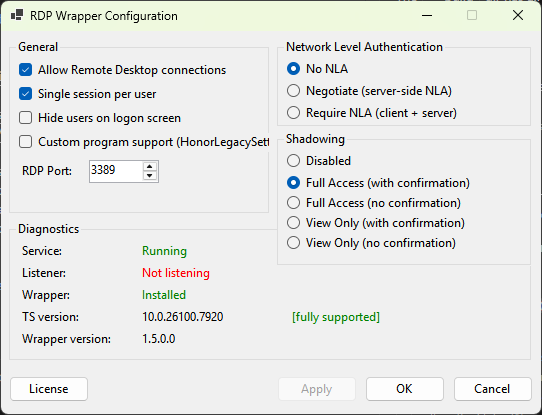
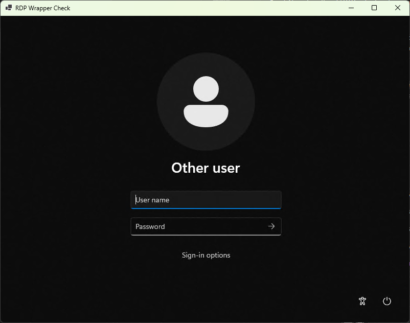
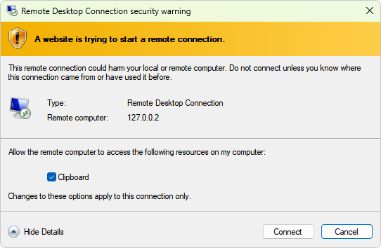
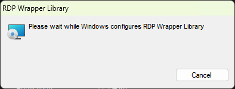
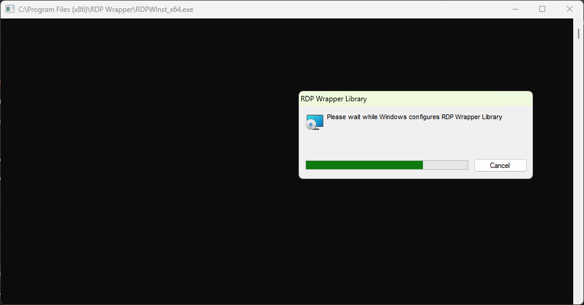

# RDP Wrapper Library

> **Maintained fork** by [@sjackson0109](https://github.com/sjackson0109) — built on the shoulders of:
> [Stas'M / binarymaster](https://github.com/stascorp/rdpwrap) (original RDP Wrapper),
> [sergiye](https://github.com/sergiye/rdpWrapper) (auto-offset generation concept), and
> [llccd](https://github.com/llccd/RDPWrapOffsetFinder) (RDPWrapOffsetFinder tool).


[](https://github.com/sjackson0109/rdpwrap/releases)
[](https://github.com/sjackson0109/rdpwrap/actions/workflows/build-and-release.yml)
[](https://github.com/sjackson0109/rdpwrap/actions/workflows/build-cpp.yml)
[](https://github.com/sjackson0109/rdpwrap/actions/workflows/build-csharp.yml)
[](https://github.com/sjackson0109/rdpwrap/actions/workflows/build-offsetfinder.yml)


The goal of this project is to enable Remote Desktop Host support and concurrent RDP sessions on reduced functionality systems for home usage.

RDP Wrapper works as a layer between Service Control Manager and Terminal Services, so the original termsrv.dll file remains untouched. Also this method is very strong against Windows Update.

> **Historical screenshots** (Vista / 7 / 8 / 10 from the original Stas'M project) are archived at:
> https://web.archive.org/web/2015*/http://stascorp.com/images/rdpwrap/*

### Screenshots

> Screenshots are captured on Windows 11 after a successful install.  
> Source files live in [`docs/images/`](docs/images/) — see the [capture guide](docs/images/README.md) if you want to contribute updated screenshots.

| RDPConf — configuration | RDPCheck — supported | RDPCheck — warning |
|:---:|:---:|:---:|
|  |  |  |

| MSI Installer — welcome | MSI Installer — complete |
|:---:|:---:|
|  |  |

---
[WinPPE]: http://forums.mydigitallife.info/threads/39411-Windows-Product-Policy-Editor

This solution was inspired by [Windows Product Policy Editor][WinPPE], big thanks to **kost** :)

— binarymaster

### Attention:
It's recommended to have original termsrv.dll file with the RDP Wrapper installation. If you have modified it before with other patchers, it may become unstable and crash in any moment.

### Information:
- Source code is available, so you can build it on your own
- RDP Wrapper does not patch termsrv.dll, it loads termsrv with different parameters
- Windows 2000, XP and Server 2003 will not be supported

### Key features:
- RDP host server on any Windows edition beginning from Vista through Windows 11
- Console and remote sessions at the same time
- Using the same user simultaneously for local and remote logon (see configuration app)
- Up to [15 concurrent sessions](https://github.com/stascorp/rdpwrap/issues/192) (the actual limitation depends on your hardware and OS version)
- Console and RDP session shadowing (using [Task Manager in Windows 7](http://cdn.freshdesk.com/data/helpdesk/attachments/production/1009641577/original/remote_control.png?1413476051) and lower, and [Remote Desktop Connection in Windows 8](http://woshub.com/rds-shadow-how-to-connect-to-a-user-session-in-windows-server-2012-r2/) and higher)
- Full [multi-monitor support](https://github.com/stascorp/rdpwrap/issues/163) for RDP host
- **Automatic INI updates** — the installer fetches the latest `rdpwrap.ini` directly from [GitHub Releases](https://github.com/sjackson0109/rdpwrap/releases/latest), published automatically by CI/CD on every change
- **Auto-generation of offsets for unknown builds** — if your `termsrv.dll` version is not yet in the INI, the installer downloads [RDPWrapOffsetFinder](https://github.com/llccd/RDPWrapOffsetFinder) and generates the missing section on-the-fly (inspired by [sergiye/rdpWrapper](https://github.com/sergiye/rdpWrapper))
- ...and if you find a new feature not listed here, [tell us](https://github.com/sjackson0109/rdpwrap/issues/new) ;)

### Porting to other platforms:
- **ARM** for Windows RT (see links below)
- **IA-64** for Itanium-based Windows Server? *Well, I have no idea* :)

### Repository structure:

```
├── msi/                        # WiX v5 MSI project + INI offset databases (rdpwrap.ini, rdpwrap-arm-kb.ini)
├── docs/                       # Developer documentation
├── src-x86-x64-Fusix/          # C++ — core rdpwrap.dll (native Win32, MSVC)
└── src-csharp/                 # C# .NET 10 — all management-plane tools
    ├── Directory.Build.props   # Shared build settings (framework, author metadata)
    ├── RDPWrap.sln             # Visual Studio solution
    ├── RDPWrap/                # Shared helper library (P/Invoke, registry, service helpers)
    ├── RDPConf/                # WinForms configuration GUI
    ├── RDPCheck/               # WinForms RDP loopback tester
    └── RDPOffsetFinder/        # Git submodule — llccd/RDPWrapOffsetFinder (C++)
        └── zydis/              # Git submodule — zyantific/zydis disassembler
```

### Building the binaries:

#### Prerequisites
- **.NET SDK 10** — all C# tools (`src-csharp/`)
  - Download: https://dotnet.microsoft.com/download/dotnet/10.0
- **Visual Studio 2022 / MSVC Build Tools v143** — two C++ components:
  - `src-x86-x64-Fusix/` — core `rdpwrap.dll`
  - `src-csharp/RDPOffsetFinder/` — offset finder (pulled via git submodule)

#### Clone with submodules
```powershell
git clone --recurse-submodules https://github.com/sjackson0109/rdpwrap.git
# or if already cloned:
git submodule update --init --recursive
```

#### Build C# tools locally
```powershell
# Debug build (both platforms)
dotnet build src-csharp/RDPWrap.sln -p:Platform=x64
dotnet build src-csharp/RDPWrap.sln -p:Platform=x86

# Release publish — single-file EXE (requires .NET 10 Desktop Runtime on target)
dotnet publish src-csharp/RDPConf/RDPConf.csproj    -c Release -r win-x64 -p:PublishSingleFile=true -p:SelfContained=false
dotnet publish src-csharp/RDPCheck/RDPCheck.csproj  -c Release -r win-x64 -p:PublishSingleFile=true -p:SelfContained=false
```

#### Build `rdpwrap.dll` locally
```powershell
msbuild src-x86-x64-Fusix/RDPWrap.vcxproj /p:Configuration=Release /p:Platform=x64 /p:PlatformToolset=v143
```

#### Build `RDPWrapOffsetFinder` locally
```powershell
# Build Zydis DLL first
msbuild src-csharp/RDPOffsetFinder/zydis/msvc/zydis/Zydis.vcxproj /p:Configuration="Release MD DLL" /p:Platform=x64 /p:PlatformToolset=v143
# Then build the offset finder
msbuild src-csharp/RDPOffsetFinder/RDPWrapOffsetFinder/RDPWrapOffsetFinder.vcxproj /p:Configuration=Release /p:Platform=x64 /p:PlatformToolset=v143
```

### CI/CD Pipelines:

| Workflow | Trigger | Output |
|---|---|---|
| [build-and-release.yml](.github/workflows/build-and-release.yml) | Push to `main`/`master` touching any source, INI, or the workflow file itself; or manual | **Canonical GitHub Release** — DLLs (x64/x86/arm64), C# tools, MSI packages, self-contained bundles, OffsetFinder, `rdpwrap.ini`, `rdpwrap-arm-kb.ini` |
| [build-csharp.yml](.github/workflows/build-csharp.yml) | PR to `main`/`master` touching `src-csharp/**`; version tag push (`v*`); or manual | PR compile check + artifact upload (no release) — use `build-and-release.yml` for a full release |
| [build-cpp.yml](.github/workflows/build-cpp.yml) | PR to `main`/`master` touching `src-x86-x64-Fusix/**`; version tag push (`v*`); or manual | PR compile check + artifact upload (no release) — use `build-and-release.yml` for a full release |
| [build-offsetfinder.yml](.github/workflows/build-offsetfinder.yml) | PR to `main`/`master` touching `src-csharp/RDPOffsetFinder/**`; version tag push (`v*`); or manual | PR compile check + artifact upload (no release) — use `build-and-release.yml` for a full release |

[andrewblock]:   http://web.archive.org/web/20150810054558/http://andrewblock.net/enable-remote-desktop-on-windows-8-core/
[mydigitallife]: http://forums.mydigitallife.info/threads/55935-RDP-Wrapper-Library-(works-with-Windows-8-1-Basic)
[xda-dev]:       http://forum.xda-developers.com/showthread.php?t=2093525&page=3
[yt-updating]:   http://www.youtube.com/watch?v=W9BpbEt1yJw
[yt-offsets]:    http://www.youtube.com/watch?v=FiD86tmRBtk

### Links:
- **This fork (maintained):**
<br>https://github.com/sjackson0109/rdpwrap/
- Original upstream repository (archived / unmaintained):
<br>https://github.com/stascorp/rdpwrap/
- Inspiration for auto-offset generation:
<br>[sergiye/rdpWrapper](https://github.com/sergiye/rdpWrapper)
- Offset finder tool used for auto-generation:
<br>[llccd/RDPWrapOffsetFinder](https://github.com/llccd/RDPWrapOffsetFinder)
- Official Telegram chat:
<br>https://t.me/rdpwrap
- Active discussion in the comments here:
<br>[Enable remote desktop on Windows 8 core / basic - Andrew Block .net][andrewblock]
- MDL Projects and Applications thread here:
<br>[RDP Wrapper Library (works with Windows 8.1 Basic)][mydigitallife]
- Some ideas about porting to ARM for Windows RT (post #23):
<br>[\[Q\] Mod Windows RT to enable Remote Desktop][xda-dev]
- Adding «Remote Desktop Users» group:
<br>http://superuser.com/questions/680572/

#### Tutorial videos:
- [~~Updating RDP Wrapper INI file manually~~][yt-updating] (now use installer to update INI file)
- [How to find offsets for new termsrv.dll versions][yt-offsets]

### Files in release package:

| File name | Architecture | Description |
| --------- | ------------ | ----------- |
| `RDPCheck_x64.exe` | x64 | Local RDP Checker — verify RDP is working (C#, requires .NET 10) |
| `RDPCheck_x86.exe` | x86 | Local RDP Checker — verify RDP is working (C#, requires .NET 10) |
| `RDPConf_x64.exe`  | x64 | RDP Wrapper Configuration GUI (C#, requires .NET 10) |
| `RDPConf_x86.exe`  | x86 | RDP Wrapper Configuration GUI (C#, requires .NET 10) |
| `rdpwrap_x64.dll`  | x64 | Core RDP Wrapper DLL (C++, no runtime required) |
| `rdpwrap_x86.dll`  | x86 | Core RDP Wrapper DLL (C++, no runtime required) |
| `rdpwrap.ini`      | — | Offset database (updated automatically on every INI push) |

### Frequently Asked Questions

> Where can I download the installer or binaries?

In the [GitHub Releases](https://github.com/sjackson0109/rdpwrap/releases) section.

> Is it legal to use this application?

There is no definitive answer, see [this discussion](https://github.com/stascorp/rdpwrap/issues/26).

> The installer tries to access the Internet, is it normal behaviour?

Yes, the MSI fetches the latest `rdpwrap.ini` from GitHub Releases on install.

> What is online install mode?

Online install mode was introduced in version 1.6.1. When installing for the first time using this mode, the installer downloads the [latest `rdpwrap.ini`](https://github.com/sjackson0109/rdpwrap/releases/latest/download/rdpwrap.ini) from this repository's GitHub Releases — published automatically by CI/CD whenever `msi/rdpwrap.ini` is updated. If your `termsrv.dll` version is not yet listed in the downloaded INI, the installer will additionally download [RDPWrapOffsetFinder](https://github.com/llccd/RDPWrapOffsetFinder) and attempt to auto-generate the missing offsets on the spot.

> What is INI file and why we need it?

INI file was introduced in version 1.5. It stores system configuration for RDP Wrapper — general wrapping settings, binary patch codes, and per build specific data. When new `termsrv.dll` build comes out, developer adds support for it by updating INI file in repository.

> Config Tool reports version 1.5, but I installed higher version. What's the matter?

Beginning with version 1.5 the `rdpwrap.dll` is not updated anymore, since all settings are stored in INI file. Deal with it.

> Config Tool shows `[not supported]` and RDP doesn't work. What can I do?

Make sure you're connected to the Internet and re-run or repair the MSI installer. It will download the latest INI from GitHub Releases and, if your `termsrv.dll` version is still missing, will automatically run [RDPWrapOffsetFinder](https://github.com/llccd/RDPWrapOffsetFinder) to generate offsets for your specific build.

> Update doesn't help, it still shows `[not supported]`.

Check the [issues](https://github.com/sjackson0109/rdpwrap/issues) section to see if your `termsrv.dll` build is mentioned. If not, please open a new issue with your exact build version (shown by the Config Tool).

> Why `RDPCheck` doesn't allow to change resolution and other settings?

`RDPCheck` is a very simple application and only for testing purposes. You need to use Microsoft Remote Desktop Client (`mstsc.exe`) if you want to customize the settings. You can use `127.0.0.1` or `127.0.0.2` address for loopback connection.

### Known issues:
- Beginning with Windows 8 **on tablet PCs** inactive sessions will be logged out by system - [more info](https://github.com/stascorp/rdpwrap/issues/37)
- Beginning with Windows 10 you can accidentally lock yourself from PC - [more info](https://github.com/stascorp/rdpwrap/issues/50)
- Beginning with the Creators Update for Windows 10 Home, RDP Wrapper will no longer work, claiming that the listener is `[not listening]` because of `rfxvmt.dll` is missing - [more info](https://github.com/stascorp/rdpwrap/issues/194#issuecomment-323564111), [download links](https://github.com/stascorp/rdpwrap/issues/194#issuecomment-325627235)
- Terminal Service does not start after installing some updates or "Access Denied" issue - [#215](https://github.com/stascorp/rdpwrap/issues/215), [#101](https://github.com/stascorp/rdpwrap/issues/101)
- RDP Wrapper does not work with RemoteFX enabled hosts - [#127](https://github.com/stascorp/rdpwrap/issues/127), [#208](https://github.com/stascorp/rdpwrap/issues/208), [#216](https://github.com/stascorp/rdpwrap/issues/216)
- RDP works, but termsrv.dll crashes on logon attempt - Windows Vista Starter RTM x86 (termsrv.dll `6.0.6000.16386`)
- If Terminal Services hangs at startup, try to add **`rdpwrap.dll`** to antivirus exclusions. Also try to isolate RDP Wrapper from other shared services by the command:
<br>`sc config TermService type= own`
- RDP Wrapper can be removed by AVG Free Antivirus and [Norton Antivirus](https://github.com/stascorp/rdpwrap/issues/191) - first make sure you downloaded [official release](https://github.com/stascorp/rdpwrap/releases) from GitHub, then add it to exclusions.

---

### Change log:

#### 2026.03.31
- **Repository housekeeping** — removed six obsolete files: `res/legacy.install.bat`, `res/clearres.bat`, `res/build_wxs.bat`, `res/RDPWInst.wxs` (WiX v3.11 MSI, unmaintained), `res/rdpwrap-ini-kb.txt` (stale 2018 INI snapshot), and empty `src-csharp/RDPWrap.Common/` stub directory
- `bin/install.bat`, `bin/uninstall.bat`, `bin/update.bat` — removed in favour of the MSI installer
- CI/CD: `build-cpp.yml`, `build-csharp.yml`, `build-offsetfinder.yml` — standalone `release` jobs removed; `build-and-release.yml` is now the sole release publisher, eliminating duplicate partial releases on tag pushes
- `build-csharp.yml` runner harmonised to `windows-2022`; hardcoded `signtool.exe` SDK path replaced with glob-based discovery
- `build-and-release.yml` — added **SHA-256 audit log** for third-party sergiye binaries; `msi/rdpwrap-arm-kb.ini` added to release assets
- **ARM64 support** — `Release|ARM64` added to `src-x86-x64-Fusix/RDPWrap.vcxproj`; `build-cpp.yml` and `build-and-release.yml` now build and ship `rdpwrap_arm64.dll`; `build-csharp.yml` and `build-and-release.yml` publish `RDPConf_arm64.exe`, `RDPCheck_arm64.exe`; `Directory.Build.props` adds `arm64` to `Platforms`
- **WiX v5 MSI packaging** — `msi/RDPWInst.wxs` (WiX v5 schema v4, dual-arch, MajorUpgrade) and `msi/RDPWInst.wixproj` implement all install/uninstall logic natively via WiX (registry, ServiceControl, firewall); replaces the deleted v3.11 artefacts; no helper EXE required
- **Self-contained publish** — `build-and-release.yml` produces `*_x64_sc.exe`, `*_x86_sc.exe`, `*_arm64_sc.exe` for all three C# tools and bundles them into `RDPWrapper-SelfContained.zip`; users without .NET 10 Desktop Runtime can use these
- **Version stamp automation** — `build-and-release.yml` computes a `yyyy.M.d` stamp and passes `-p:Version=` to every `dotnet publish` call; `Directory.Build.props` documents the CI override pattern
- **Changelog automation** — `build-and-release.yml` now includes a `Generate changelog` step that queries merged PRs since the previous release and embeds them in the GitHub Release body
- **Dependabot** — `.github/dependabot.yml` added for `github-actions` and `nuget` ecosystems (weekly, Monday schedule)
- **Sergiye hash-pin scaffold** — `tools/sergiye-hashes.json` created; `build-and-release.yml` validates downloaded `rdpWrapper_*.exe` hashes against this file when populated
- **Code-signing guide** added — `docs/CODE-SIGNING.md` documents certificate acquisition, PFX export, base64 encoding, and GitHub secret upload; the signing step in `build-and-release.yml` and `build-csharp.yml` fires automatically once `CODESIGN_CERT_BASE64` and `CODESIGN_CERT_PASSWORD` secrets are set
- **Sergiye hash pins live** — `tools/update-sergiye-hashes.ps1` automation script created; `tools/sergiye-hashes.json` populated with verified SHA-256 hashes for `sergiye/rdpWrapper` release `2.10`; `build-and-release.yml` hash-verification step is now enforcing the pinned values
- **Screenshot infrastructure** — `docs/images/` directory and capture guide created; README restored with four-cell screenshot table using relative in-repo paths (PNG files pending first capture)
- **Submodule shallow-clone** — `shallow = true` added to `.gitmodules`; `docs/SUBMODULE-UPDATE.md` documents check-out, update, and rollback procedures (`RDPOffsetFinder` is already pinned to `v0.9`)
- **`tools/` reference added to `docs/`** — `update-sergiye-hashes.ps1` is self-documenting via `Get-Help`; `CODE-SIGNING.md`, `SUBMODULE-UPDATE.md`, `images/README.md` added to `docs/`

#### 2026.03.30
- **Full C# port complete** — `RDPConf`, `RDPCheck`, and shared library all ported from Delphi to C# / .NET 10; Delphi is no longer required to build
- Obsolete Delphi source folders removed (`src-installer/`, `src-rdpcheck/`, `src-rdpconfig/`, `src-x86-binarymaster/`)
- Shared library renamed from `RDPWrap.Common/` to `RDPWrap/` for a cleaner folder layout; namespace `RDPWrap.Common` preserved for source compatibility
- **[llccd/RDPWrapOffsetFinder](https://github.com/llccd/RDPWrapOffsetFinder) added as a git submodule** at `src-csharp/RDPOffsetFinder/` (including nested `zydis` → `zycore` submodules) — offset finder now built from source rather than fetching pre-built binaries
- Pre-built binary cache (`tools/RDPWrapOffsetFinder/`) and `update-finder-tools.yml` workflow removed; `build-and-release.yml` now builds the offset finder directly from the submodule
- New workflow [`build-offsetfinder.yml`](.github/workflows/build-offsetfinder.yml) — builds `RDPWrapOffsetFinder` + `Zydis.dll` for x64 and Win32 from source on version tag push
- New workflow [`build-csharp.yml`](.github/workflows/build-csharp.yml) — publishes self-contained single-file x64/x86 EXEs on version tag push; optional `signtool.exe` code-signing step wired to `CODESIGN_CERT_BASE64` / `CODESIGN_CERT_PASSWORD` repository secrets
- [`build-and-release.yml`](.github/workflows/build-and-release.yml) updated — checkout uses `submodules: recursive`; builds and bundles `RDPConf`, `RDPCheck`, and `RDPWrapOffsetFinder` (all x64 + x86) alongside the existing DLL and INI assets
- Author metadata (`Simon Jackson / @sjackson0109`, copyright, repository URL) embedded into all four C# assemblies via `Directory.Build.props`
- `src-csharp/Directory.Build.props` targets `net10.0-windows`; `x86` and `x64` platforms; `Nullable` + `ImplicitUsings` enabled

#### 2026.03.29
- Fork maintained by [@sjackson0109](https://github.com/sjackson0109)
- INI source redirected from unmaintained stascorp upstream to this repository's GitHub Releases
- **CI/CD pipeline added** — [`build-and-release.yml`](.github/workflows/build-and-release.yml) publishes `rdpwrap.ini` and the `RDPWrapOffsetFinder` tools as release assets on every INI change
- **CI/CD pipeline added** — [`build-cpp.yml`](.github/workflows/build-cpp.yml) builds `rdpwrap_x64.dll` / `rdpwrap_x86.dll` via MSVC v143 (VS 2022) on version tag push
- **Auto-offset generation** — on install, if the running `termsrv.dll` version is absent from the INI the MSI downloads `RDPWrapOffsetFinder` from release assets and appends the generated `[x.x.xxxxx.xxxxx]` section automatically; inspired by [sergiye/rdpWrapper](https://github.com/sergiye/rdpWrapper)
- New installer helpers: `DownloadFileToDisk`, `INIHasSection`, `TryAutoGenerateOffsets`

#### 2017.12.27
- Version 1.6.2
- Installer updated
- Include updated INI file for latest Windows builds
- Added check for supported Windows versions ([#155](https://github.com/stascorp/rdpwrap/issues/155))
- Added feature to take INI file from current directory ([#300](https://github.com/stascorp/rdpwrap/issues/300))
- Added feature to restore rfxvmt.dll (missing in Windows 10 Home [#194](https://github.com/stascorp/rdpwrap/issues/194))
- RDP Config updated
- Added feature to allow custom start programs ([#13 (comment)](https://github.com/stascorp/rdpwrap/issues/13#issuecomment-77651843))
- MSI installation package added ([#14](https://github.com/stascorp/rdpwrap/issues/14))

#### 2016.08.01
- Version 1.6.1
- Include updated INI file for latest Windows builds
- Installer updated
- Added online install mode
- Added feature to keep settings on uninstall
- RDP Config updated
- Fixed update firewall rule on RDP port change
- Added feature to hide users on logon

#### 2015.08.12
- Version 1.6
- Added support for Windows 10
- INI file has smaller size now - all comments are moved to KB file
- Installer updated
- Added workaround for 1056 error (although it isn't an error)
- Added update support to installer
- Newest RDPClip versions are included with installer
- RDP Checker updated
- Changed connect IP to 127.0.0.2
- Updated some text messages
- RDP Config updated
- Added all possible shadowing modes
- Also it will write settings to the group policy

#### 2014.12.11
- Version 1.5
- Added INI config support
- Configuration is stored in INI file now
- We can extend version support without building new binaries
- Added support for Windows 8.1 with KB3000850
- Added support for Windows 10 Technical Preview Update 2
- Installer updated
- RDP Config updated
- Diagnostics feature added to RDP Config

#### 2014.11.14
- Version 1.4
- Added support for Windows 10 Technical Preview Update 1
- Added support for Windows Vista SP2 with KB3003743
- Added support for Windows 7 SP1 with KB3003743
- Added new RDP Configuration Program

#### 2014.10.21
- Installer updated
- Added feature to install RDP Wrapper to System32 directory
- Fixed issue in the installer - NLA setting now remains unchanged
- Local RDP Checker updated
- SecurityLayer and UserAuthentification values changed on check start
- RDP Checker restores values on exit

#### 2014.10.20
- Version 1.3
- Added support for Windows 10 Technical Preview
- Added support for Windows 7 with KB2984972
- Added support for Windows 8 with KB2973501
- Added extended support for Windows Vista (SP0, SP1 and SP2)
- Added extended support for Windows 7 (SP0 and SP1)
- Some improvements in the source code
- Installer updated to v2.2
- Fixed installation bug in Vista x64 (wrong expand path)
- Local RDP Checker updated
- Added description to error 0x708

#### 2014.07.26
- Version 1.2
- Added support for Windows 8 Developer Preview
- Added support for Windows 8 Consumer Preview
- Added support for Windows 8 Release Preview
- Added support for Windows 8.1 Preview
- Added support for Windows 8.1
- More details you will see in the source code
- Installer updated to v2.1

#### 2013.12.09
- C++ port of RDP Wrapper was made by Fusix
- x64 architecture is supported now
- Added new command line installer v2.0
- Added local RDP checker
- Source code (C++ port, installer 2.0, local RDP checker) is also included

#### 2013.10.25
- Version 1.1 source code is available

#### 2013.10.22
- Version 1.1
- Stable release
- Improved wrapper (now it can wrap internal unexported termsrv.dll SL Policy function)
- Added support for Windows 8 Single Language (tested on Acer Tablet PC with Intel Atom Z2760)

#### 2013.10.19
- Version 1.0
- First [beta] version
- Basic SL Policy wrapper

---

#### Supported Terminal Services versions:
- 6.0.X.X (Windows Vista / Server 2008)
- 6.0.6000.16386 (Windows Vista)
- 6.0.6001.18000 (Windows Vista SP1)
- 6.0.6002.18005 (Windows Vista SP2)
- 6.0.6002.19214 (Windows Vista SP2 with KB3003743 GDR)
- 6.0.6002.23521 (Windows Vista SP2 with KB3003743 LDR)
- 6.1.X.X (Windows 7 / Server 2008 R2)
- 6.1.7600.16385 (Windows 7)
- 6.1.7600.20890 (Windows 7 with KB2479710)
- 6.1.7600.21316 (Windows 7 with KB2750090)
- 6.1.7601.17514 (Windows 7 SP1)
- 6.1.7601.21650 (Windows 7 SP1 with KB2479710)
- 6.1.7601.21866 (Windows 7 SP1 with KB2647409)
- 6.1.7601.22104 (Windows 7 SP1 with KB2750090)
- 6.1.7601.18540 (Windows 7 SP1 with KB2984972 GDR)
- 6.1.7601.22750 (Windows 7 SP1 with KB2984972 LDR)
- 6.1.7601.18637 (Windows 7 SP1 with KB3003743 GDR)
- 6.1.7601.22843 (Windows 7 SP1 with KB3003743 LDR)
- 6.1.7601.23403 (Windows 7 SP1 with KB3125574)
- 6.1.7601.24234 (Windows 7 SP1 with KB4462923)
- 6.2.8102.0 (Windows 8 Developer Preview)
- 6.2.8250.0 (Windows 8 Consumer Preview)
- 6.2.8400.0 (Windows 8 Release Preview)
- 6.2.9200.16384 (Windows 8 / Server 2012)
- 6.2.9200.17048 (Windows 8 with KB2973501 GDR)
- 6.2.9200.21166 (Windows 8 with KB2973501 LDR)
- 6.3.9431.0 (Windows 8.1 Preview)
- 6.3.9600.16384 (Windows 8.1 / Server 2012 R2)
- 6.3.9600.17095 (Windows 8.1 with KB2959626)
- 6.3.9600.17415 (Windows 8.1 with KB3000850)
- 6.3.9600.18692 (Windows 8.1 with KB4022720)
- 6.3.9600.18708 (Windows 8.1 with KB4025335)
- 6.3.9600.18928 (Windows 8.1 with KB4088876)
- 6.3.9600.19093 (Windows 8.1 with KB4343891)
- 6.4.9841.0 (Windows 10 Technical Preview)
- 6.4.9860.0 (Windows 10 Technical Preview Update 1)
- 6.4.9879.0 (Windows 10 Technical Preview Update 2)
- 10.0.9926.0 (Windows 10 Pro Technical Preview)
- 10.0.10041.0 (Windows 10 Pro Technical Preview Update 1)
- 10.0.10240.16384 (Windows 10 RTM)
- 10.0.10586.0 (Windows 10 TH2 Release 151029-1700)
- 10.0.10586.589 (Windows 10 TH2 Release 160906-1759 with KB3185614)
- 10.0.11082.1000 (Windows 10 RS1 Release 151210-2021)
- 10.0.11102.1000 (Windows 10 RS1 Release 160113-1800)
- 10.0.14251.1000 (Windows 10 RS1 Release 160124-1059)
- 10.0.14271.1000 (Windows 10 RS1 Release 160218-2310)
- 10.0.14279.1000 (Windows 10 RS1 Release 160229-1700)
- 10.0.14295.1000 (Windows 10 RS1 Release 160318-1628)
- 10.0.14300.1000 (Windows Server 2016 Technical Preview 5)
- 10.0.14316.1000 (Windows 10 RS1 Release 160402-2227)
- 10.0.14328.1000 (Windows 10 RS1 Release 160418-1609)
- 10.0.14332.1001 (Windows 10 RS1 Release 160422-1940)
- 10.0.14342.1000 (Windows 10 RS1 Release 160506-1708)
- 10.0.14352.1002 (Windows 10 RS1 Release 160522-1930)
- 10.0.14366.0 (Windows 10 RS1 Release 160610-1700)
- 10.0.14367.0 (Windows 10 RS1 Release 160613-1700)
- 10.0.14372.0 (Windows 10 RS1 Release 160620-2342)
- 10.0.14379.0 (Windows 10 RS1 Release 160627-1607)
- 10.0.14383.0 (Windows 10 RS1 Release 160701-1839)
- 10.0.14385.0 (Windows 10 RS1 Release 160706-1700)
- 10.0.14388.0 (Windows 10 RS1 Release 160709-1635)
- 10.0.14393.0 (Windows 10 RS1 Release 160715-1616)
- 10.0.14393.1198 (Windows 10 RS1 Release Sec 170427-1353 with KB4019472)
- 10.0.14393.1737 (Windows 10 RS1 Release Inmarket 170914-1249 with KB4041691)
- 10.0.14393.2457 (Windows 10 RS1 Release Inmarket 180822-1743 with KB4343884)
- 10.0.14901.1000 (Windows 10 RS Pre-Release 160805-1700)
- 10.0.14905.1000 (Windows 10 RS Pre-Release 160811-1739)
- 10.0.14915.1000 (Windows 10 RS Pre-Release 160826-1902)
- 10.0.14926.1000 (Windows 10 RS Pre-Release 160910-1529)
- 10.0.14931.1000 (Windows 10 RS Pre-Release 160916-1700)
- 10.0.14936.1000 (Windows 10 RS Pre-Release 160923-1700)
- 10.0.14942.1000 (Windows 10 RS Pre-Release 161003-1929)
- 10.0.14946.1000 (Windows 10 RS Pre-Release 161007-1700)
- 10.0.14951.1000 (Windows 10 RS Pre-Release 161014-1700)
- 10.0.14955.1000 (Windows 10 RS Pre-Release 161020-1700)
- 10.0.14959.1000 (Windows 10 RS Pre-Release 161026-1700)
- 10.0.14965.1001 (Windows 10 RS Pre-Release 161104-1700)
- 10.0.14971.1000 (Windows 10 RS Pre-Release 161111-1700)
- 10.0.14986.1000 (Windows 10 Build 160101.0800)
- 10.0.14997.1001 (Windows 10 Build 160101.0800)
- 10.0.15002.1001 (Windows 10 Build 160101.0800)
- 10.0.15007.1000 (Windows 10 Build 160101.0800)
- 10.0.15014.1000 (Windows 10 Build 160101.0800)
- 10.0.15019.1000 (Windows 10 RS Pre-Release 170121-1513)
- 10.0.15025.1000 (Windows 10 RS Pre-Release 170127-1750)
- 10.0.15031.0 (Windows 10 RS2 Release 170204-1546)
- 10.0.15042.0 (Windows 10 RS2 Release 170219-2329)
- 10.0.15046.0 (Windows 10 Build 160101.0800)
- 10.0.15048.0 (Windows 10 Build 160101.0800)
- 10.0.15055.0 (Windows 10 Build 160101.0800)
- 10.0.15058.0 (Windows 10 Build 160101.0800)
- 10.0.15061.0 (Windows 10 Build 160101.0800)
- 10.0.15063.0 (Windows 10 Build 160101.0800)
- 10.0.15063.296 (Windows 10 Build 160101.0800)
- 10.0.15063.994 (Windows 10 Build 160101.0800)
- 10.0.15063.1155 (Windows 10 Build 160101.0800)
- 10.0.16179.1000 (Windows 10 Build 160101.0800)
- 10.0.16184.1001 (Windows 10 Build 160101.0800)
- 10.0.16199.1000 (Windows 10 Build 160101.0800)
- 10.0.16215.1000 (Windows 10 Build 160101.0800)
- 10.0.16232.1000 (Windows 10 Build 160101.0800)
- 10.0.16237.1001 (Windows 10 Build 160101.0800)
- 10.0.16241.1001 (Windows 10 Build 160101.0800)
- 10.0.16251.0 (Windows 10 Build 160101.0800)
- 10.0.16251.1000 (Windows 10 Build 160101.0800)
- 10.0.16257.1 (Windows 10 Build 160101.0800)
- 10.0.16257.1000 (Windows 10 Build 160101.0800)
- 10.0.16273.1000 (Windows 10 Build 160101.0800)
- 10.0.16275.1000 (Windows 10 Build 160101.0800)
- 10.0.16278.1000 (Windows 10 Build 160101.0800)
- 10.0.16281.1000 (Windows 10 Build 160101.0800)
- 10.0.16288.1 (Windows 10 Build 160101.0800)
- 10.0.16291.0 (Windows 10 Build 160101.0800)
- 10.0.16294.1 (Windows 10 Build 160101.0800)
- 10.0.16296.0 (Windows 10 Build 160101.0800)
- 10.0.16299.0 (Windows 10 Build 160101.0800)
- 10.0.16299.15 (Windows 10 Build 160101.0800)
- 10.0.16353.1000 (Windows 10 Build 160101.0800)
- 10.0.16362.1000 (Windows 10 Build 160101.0800)
- 10.0.17004.1000 (Windows 10 Build 160101.0800)
- 10.0.17017.1000 (Windows 10 Build 160101.0800)
- 10.0.17025.1000 (Windows 10 Build 160101.0800)
- 10.0.17035.1000 (Windows 10 Build 160101.0800)
- 10.0.17046.1000 (Windows 10 Build 160101.0800)
- 10.0.17063.1000 (Windows 10 Build 160101.0800)
- 10.0.17115.1 (Windows 10 Build 160101.0800)
- 10.0.17128.1 (Windows 10 Build 160101.0800)
- 10.0.17133.1 (Windows 10 Build 160101.0800)
- 10.0.17134.1 (Windows 10 Build 160101.0800)
- 10.0.17723.1000 (Windows 10 Build 160101.0800)
- 10.0.17763.1 (Windows 10 Build 160101.0800)

#### Confirmed working on:
- Windows Vista Starter (x86 - Service Pack 1 and higher)
- Windows Vista Home Basic
- Windows Vista Home Premium
- Windows Vista Business
- Windows Vista Enterprise
- Windows Vista Ultimate
- Windows Server 2008
- Windows 7 Starter
- Windows 7 Home Basic
- Windows 7 Home Premium
- Windows 7 Professional
- Windows 7 Enterprise
- Windows 7 Ultimate
- Windows Server 2008 R2
- Windows 8 Developer Preview
- Windows 8 Consumer Preview
- Windows 8 Release Preview
- Windows 8
- Windows 8 Single Language
- Windows 8 Pro
- Windows 8 Enterprise
- Windows Server 2012
- Windows 8.1 Preview
- Windows 8.1
- Windows 8.1 Connected (with Bing)
- Windows 8.1 Single Language
- Windows 8.1 Connected Single Language (with Bing)
- Windows 8.1 Pro
- Windows 8.1 Enterprise
- Windows Server 2012 R2
- Windows 10 Technical Preview
- Windows 10 Pro Technical Preview
- Windows 10 Home
- Windows 10 Home Single Language
- Windows 10 Pro
- Windows 10 Enterprise
- Windows Server 2016 Technical Preview

Installation instructions:
- Download `RDPWrapper-<version>.msi` from the [GitHub Releases](https://github.com/sjackson0109/rdpwrap/releases) page
- Double-click the MSI and accept the UAC prompt — the installer detects your architecture automatically
- See command output for details

To update INI file:
- Re-run the MSI (choose **Repair**) — it will download the latest `rdpwrap.ini` from GitHub Releases automatically
- See the MSI log for details

To uninstall:
- Open **Add or Remove Programs** and uninstall **RDP Wrapper Library**
- Alternatively run `msiexec /x RDPWrapper-<version>.msi` from an elevated prompt
